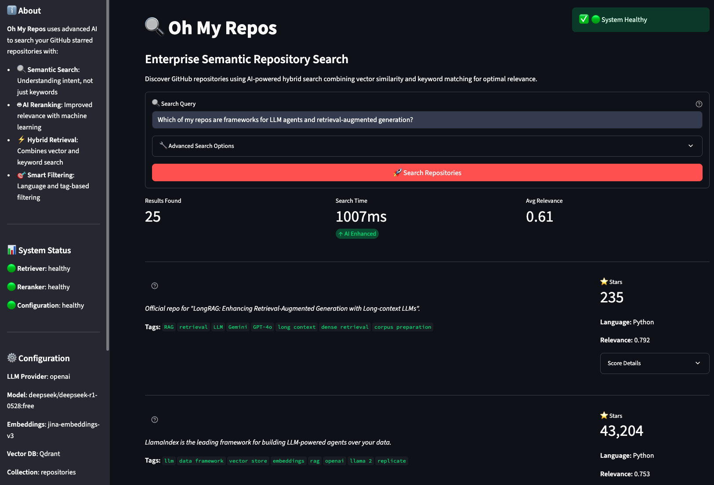

# Oh My Repos

Semantic search and RAG chat over your GitHub repositories, built on a hybrid BM25 + vector search stack with a modern FastAPI + Next.js architecture.

[](https://www.python.org/)
[](https://fastapi.tiangolo.com/)
[](https://nextjs.org/)
[](https://qdrant.tech/)
[](https://jina.ai/)
[](http://creativecommons.org/publicdomain/zero/1.0/)

---

## Overview

Oh My Repos indexes your GitHub repositories, generates summaries/embeddings, and serves hybrid search plus streaming RAG chat.



---

## Key Features

- **Hybrid search** (BM25 + dense vectors) with optional reranking.
- **Streaming RAG chat** over SSE using retrieved repo context.
- **Discovery Agent** — AI-powered GitHub discovery with profile analysis, smart search, and LLM-based scoring.
- **MCP Server** — Model Context Protocol integration for Claude Desktop/Cursor with search, RAG, and similarity tools.
- Async ingestion pipeline for GitHub stars → summaries → embeddings → Qdrant.
- Pluggable providers: OpenRouter/OpenAI/Ollama for LLM; Jina or Ollama embeddings.

---

## Quick Start

1) Install dependencies
```bash
python -m venv .venv && source .venv/bin/activate
pip install -r requirements.txt
cd ui && npm install && cd ..
```

2) Configure & ingest (auto-prompts, defaults to Ollama embeddings with 10s timeout)
```bash
cp .env.example .env
./run.sh setup   # collects keys, pulls embedding model if needed, runs collect+embed
```
> [!WARNING]
> Ingestion triggers embedding/LLM calls; start with a small repo set while validating.

3) Run locally
```bash
./run.sh dev           # backend http://127.0.0.1:8000 + frontend http://localhost:3000
# or ./run.sh b start / ./run.sh f start to run individually
```

4) Docker stack (API + Qdrant only; Ollama stays on host)
```bash
./run.sh stack up
./run.sh stack down
./run.sh stack logs    # tail API/Qdrant logs
```

5) MCP tools (Claude Desktop / Cursor)
```bash
./run.sh mcp           # stdio transport for MCP tools
```

---

## Discovery Agent

AI-powered GitHub repository discovery that learns from your starred repos and finds high-quality matches.

**Features:**
- Profile analysis: LLM identifies interest clusters from your starred repositories
- Smart search: Multi-strategy GitHub search with query generation and iterative relaxation
- LLM scoring: Evaluates candidates based on relevance, quality, and alignment with your interests
- Interactive actions: Star or ingest discovered repos directly from the CLI

**Usage:**
```bash
# Discover repos based on your profile
python -m src.cli agent discover

# Skip profile analysis and search directly
python -m src.cli agent discover --skip-profile

# Focus on a specific category
python -m src.cli agent discover --category "RAG frameworks"

# Limit results
python -m src.cli agent discover --max-results 10
```

**How it works:**
1. **Profile Analysis**: Analyzes your starred repos to identify interest clusters (e.g., "AI Agents", "Web Frameworks")
2. **Smart Search**: Generates optimized GitHub queries and searches with multiple strategies (specific → relaxed → broad)
3. **Deduplication**: Excludes repos you've already starred or indexed
4. **LLM Scoring**: Evaluates each candidate on relevance, quality, and fit (score 0-10)
5. **Interactive Actions**: Star repos on GitHub or ingest them into your local collection

---

## MCP Server

Model Context Protocol server for seamless integration with Claude Desktop and Cursor.

**Available Tools:**
- `search_repos`: Hybrid search over your indexed repositories
- `get_repo_summary`: Retrieve stored summary and metadata for a specific repo
- `ask_about_repos`: RAG-style Q&A using repository context
- `get_similar_repos`: Find repositories similar to a given anchor repo

**Setup for Claude Desktop:**
```json
{
  "mcpServers": {
    "ohmyrepos": {
      "command": "/path/to/ohmyrepos/.venv/bin/python",
      "args": ["/path/to/ohmyrepos/mcp_server.py"],
      "env": {
        "PYTHONPATH": "/path/to/ohmyrepos"
      }
    }
  }
}
```

**Usage in Claude/Cursor:**
```
"Search my repos for RAG frameworks"
"What's the summary of langchain/langchain?"
"Find repos similar to vercel/next.js"
"Which repos use TypeScript and focus on AI agents?"
```

---

## Tech Stack

| Layer        | Technology                                       |
|-------------|---------------------------------------------------|
| Backend API | FastAPI, httpx, Pydantic, structlog               |
| Frontend UI | Next.js (App Router), React, Tailwind CSS         |
| Vector DB   | Qdrant (cloud or Docker)                          |
| Embeddings  | Jina embeddings (default) or Ollama embeddings    |
| Reranker    | Jina reranker                                     |
| LLM         | OpenAI/OpenRouter-compatible APIs or local Ollama |
| CLI / Batch | Typer, Rich                                       |

---

📚 [Detailed Implementation Guide](docs/IMPLEMENTATION.md)
