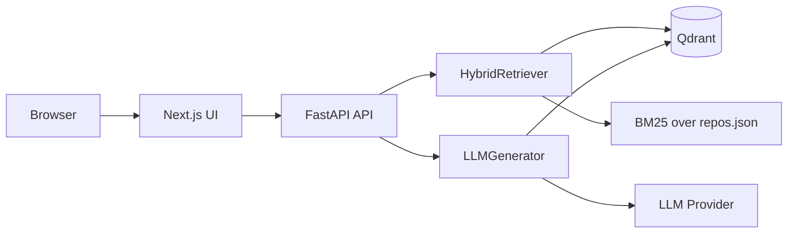
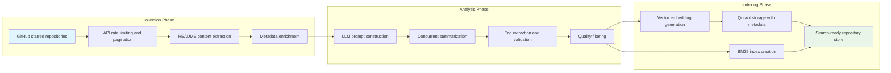
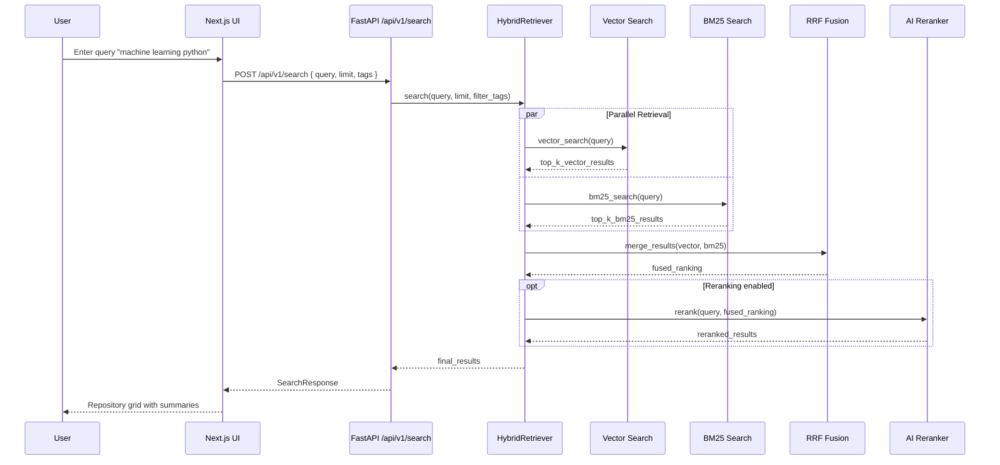
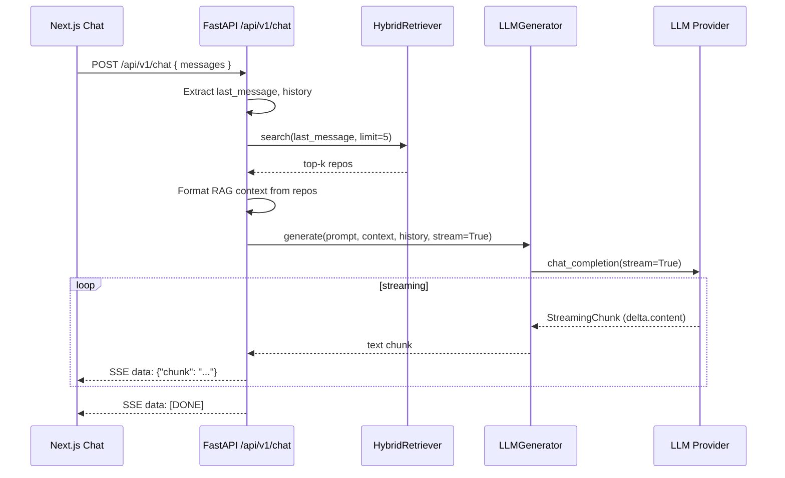

# Oh My Repos – Implementation Guide

> [!NOTE]
> This document describes the internal architecture, data pipelines, configuration and operational details of Oh My Repos.
> For a short overview and quick start instructions, see `README.md`.

---

## Table of Contents

1. [Architecture Overview](#architecture-overview)
2. [Runtime Architecture](#runtime-architecture)
3. [Data Processing Pipeline](#data-processing-pipeline)
4. [Search Query Flow](#search-query-flow)
5. [Backend Implementation (FastAPI)](#backend-implementation-fastapi)
6. [Frontend Implementation (Nextjs)](#frontend-implementation-nextjs)
7. [Vector Search and Hybrid Retrieval](#vector-search-and-hybrid-retrieval)
8. [LLM & RAG Chat](#llm--rag-chat)
9. [CLI & Batch Ingestion](#cli--batch-ingestion)
10. [MCP / Agent Integrations](#mcp--agent-integrations)
11. [Setup Automation & Dev Tooling](#setup-automation--dev-tooling)
12. [Configuration & Environments](#configuration--environments)
13. [API Reference](#api-reference)
14. [Architecture Decisions (ADR-style)](#architecture-decisions-adr-style)
15. [Troubleshooting](#troubleshooting)

---

## Architecture Overview

Oh My Repos is a semantic search and RAG system for GitHub repositories. It combines:

- a FastAPI backend that exposes search and chat endpoints,
- a Next.js frontend for interactive search and conversation,
- a Qdrant vector database plus BM25 index for hybrid retrieval,
- an ingestion pipeline (CLI) that collects repositories, generates LLM summaries and embeddings.

High-level components:

- **Ingestion pipeline** – `src/core/collector.py`, `src/core/summarizer.py`, `src/core/embeddings`, `src/core/storage.py`, `src/ingestion/pipeline.py`, orchestrated by `src/cli.py`.
- **Search engine** – `src/core/retriever.py` (HybridRetriever, BM25 + Qdrant + optional reranker).
- **Chat engine (RAG)** – `src/api/routers/chat.py`, `src/llm/generator.py`, `src/llm/chat_adapter.py`, `src/llm/providers/*`.
- **HTTP API** – `src/api/main.py`, routers under `src/api/routers`.
- **Web UI** – Next.js app in `ui/` (App Router), with an SPA that talks to the FastAPI backend through `ui/next.config.ts` rewrites.

---

## Runtime Architecture

### High-Level System Flow

```mermaid
graph TD
    subgraph "Data Collection Layer"
        GITHUB[GitHub API]
        COLLECTOR[Async Repository Collector]
        RATE_LIMITER[Rate Limiter & Backpressure]
    end

    subgraph "Processing Pipeline"
        LLM_SUMMARIZER[LLM Summarizer (OpenAI/Ollama)]
        EMBEDDING_GEN[Embedding Generation (Jina/Ollama)]
        CONCURRENT_PROC[Concurrent Processing Pool]
    end

    subgraph "Storage Layer"
        QDRANT[(Qdrant Vector DB)]
        BM25_INDEX[BM25 Lexical Index]
        JSON_CACHE[JSON Metadata Cache]
    end

    subgraph "Retrieval Engine"
        HYBRID_SEARCH[Hybrid Retriever]
        VECTOR_SEARCH[Dense Vector Search]
        LEXICAL_SEARCH[Sparse BM25 Search]
        RRF_FUSION[Reciprocal Rank Fusion]
        AI_RERANKER[Jina AI Reranker]
    end

    subgraph "Interface Layer"
        CLI[Typer CLI and batch tools]
        NEXTJS[Next.js Web UI]
    end

    GITHUB --> COLLECTOR
    COLLECTOR --> RATE_LIMITER
    RATE_LIMITER --> CONCURRENT_PROC
    
    CONCURRENT_PROC --> LLM_SUMMARIZER
    CONCURRENT_PROC --> EMBEDDING_GEN
    
    LLM_SUMMARIZER --> JSON_CACHE
    EMBEDDING_GEN --> QDRANT
    JSON_CACHE --> BM25_INDEX
    
    HYBRID_SEARCH --> VECTOR_SEARCH
    HYBRID_SEARCH --> LEXICAL_SEARCH
    VECTOR_SEARCH --> QDRANT
    LEXICAL_SEARCH --> BM25_INDEX
    
    VECTOR_SEARCH --> RRF_FUSION
    LEXICAL_SEARCH --> RRF_FUSION
    RRF_FUSION --> AI_RERANKER
    
    AI_RERANKER --> CLI
    AI_RERANKER --> NEXTJS
```

### Backend/Frontend/Infra Integration



---

## Data Processing Pipeline

### Ingestion Phases



Key implementation points:

- `src/core/collector.py` streams starred repositories from GitHub with pagination and rate limiting.
- `src/core/summarizer.py` calls `src/llm/generator.py` to generate summaries and tags.
- `src/core/embeddings/*` encapsulate embedding providers (Jina by default, optional Ollama).
- `src/core/storage.py` persists enriched repos and embeddings into Qdrant (collection name derived from provider).
- `src/core/retriever.py` builds an in-memory BM25 index over the same repository metadata.

---

## Search Query Flow



Implementation reference: `src/core/retriever.py`, `src/core/reranker.py`, `src/api/routers/search.py`.

---

## Backend Implementation (FastAPI)

### Entry Point and Routers

- FastAPI app: `src/api/main.py`
  - Configures structured logging with `structlog`.
  - Adds `LoggingMiddleware` for request/response logging.
  - Applies CORS based on `src/config.py::settings.security`.
  - Registers routers:
    - `src/api/routers/health.py` (health checks).
    - `src/api/routers/search.py` (search + random).
    - `src/api/routers/ingest.py` (ingestion API).
    - `src/api/routers/chat.py` (RAG chat streaming).

**Example: application wiring**

```python
# src/api/main.py
app = FastAPI(
    title="Oh My Repos API",
    description="Semantic search API for GitHub repositories",
    version="1.0.0",
    lifespan=lifespan,
)

app.add_middleware(LoggingMiddleware)

if settings.security.enable_cors:
    app.add_middleware(
        CORSMiddleware,
        allow_origins=settings.security.cors_origins,
        allow_credentials=True,
        allow_methods=["*"],
        allow_headers=["*"],
    )

app.include_router(health.router, tags=["health"])
app.include_router(search.router, prefix="/api/v1", tags=["search"])
app.include_router(ingest.router, prefix="/api/v1", tags=["ingestion"])
app.include_router(chat.router, prefix="/api/v1", tags=["chat"])
```

### Search Endpoint

- Path: `POST /api/v1/search`
- Request model: `SearchRequest` in `src/api/routers/search.py`.
- Response model: `SearchResponse` (normalized repository fields).
- Behavior:
  - Enforces per-IP rate limiting via `rate_limit_dependency`.
  - Validates that `settings.qdrant` is configured.
  - Uses `HybridRetriever` for BM25 + vector search.
  - Tracks token budget with `get_budget_tracker()` and `log_token_usage`.

### Random Endpoint

- Path: `GET /api/v1/random?limit=10`
- Returns random repositories directly from Qdrant (`QdrantStore.get_random_repositories`).

### Chat Endpoint (Streaming RAG)

- Path: `POST /api/v1/chat`
- Request model:

```python
class ChatMessage(BaseModel):
    role: str
    content: str

class ChatRequest(BaseModel):
    messages: List[ChatMessage]
```

- Flow:
  1. The handler extracts `history` and the last user message.
  2. If Qdrant is configured, it runs a hybrid search for the last message, formats a RAG context with top repositories.
  3. Calls `LLMGenerator.generate(..., stream=True)` to obtain an async generator of text chunks.
  4. Wraps each chunk into Server-Sent Events (`data: {"chunk": "..."}\n\n`) and terminates with `data: [DONE]\n\n`.

```python
# StreamingResponse in src/api/routers/chat.py
async def event_generator():
    stream = await generator.generate(
        prompt=last_message,
        context=context,
        history=history,
        stream=True,
    )
    async for chunk in stream:
        if chunk:
            yield f"data: {json.dumps({'chunk': chunk})}\n\n"
    yield "data: [DONE]\n\n"

return StreamingResponse(event_generator(), media_type="text/event-stream")
```

---

## Frontend Implementation (Nextjs)

### Structure

- Root: `ui/`
  - `app/` – Next.js App Router (`page.tsx`, `layout.tsx`).
  - `components/` – UI components (search, grid, chat, sidebar).
  - `hooks/useChat.ts` – streaming chat hook that consumes SSE from `/api/v1/chat`.
  - `next.config.ts` – rewrites to proxy `/api` to the FastAPI backend.

**API proxy**

```ts
// ui/next.config.ts
const nextConfig: NextConfig = {
  async rewrites() {
    return [
      {
        source: '/api/:path*',
        destination: 'http://127.0.0.1:8000/api/:path*',
      },
    ];
  },
};
```

### Search Page and Chat

- `ui/app/page.tsx`:
  - Manages search query state.
  - Renders `SearchInput`, `RepoGrid` and `ChatInterface`.
  - When user submits a search, it sets `chatQuery` and mounts `ChatInterface` with an initial question.

- `ui/components/ChatInterface.tsx`:
  - Renders the conversation using `useChat`.
  - Shows a markdown-enabled bubble for assistant responses (via `ReactMarkdown`).

- `ui/hooks/useChat.ts`:
  - Maintains `messages` and `isLoading` state.
  - On `sendMessage`, posts to `/api/v1/chat` and incrementally updates the assistant message from SSE chunks.

```ts
// Simplified streaming loop
const reader = response.body.getReader();
const decoder = new TextDecoder();
let buffer = '';
let assistantMessage = '';
let isDone = false;

while (!isDone) {
  const { done, value } = await reader.read();
  if (done) break;

  buffer += decoder.decode(value, { stream: true });
  const lines = buffer.split('\n\n');
  buffer = lines.pop() || '';

  for (const line of lines) {
    if (!line.startsWith('data: ')) continue;
    const data = line.slice(6);
    const trimmed = data.trim();
    if (trimmed === '[DONE]') {
      isDone = true;
      break;
    }

    let chunk: string | null = null;
    try {
      const parsed = JSON.parse(trimmed);
      if (parsed?.error) { /* show toast, abort */ }
      else if (typeof parsed === 'string') chunk = parsed;
      else if (parsed?.chunk) chunk = parsed.chunk;
    } catch {
      chunk = data;
    }

    if (chunk) {
      assistantMessage += chunk;
      setMessages(prev => {
        const next = [...prev];
        next[next.length - 1] = { role: 'assistant', content: assistantMessage };
        return next;
      });
    }
  }
}
```

---

## Vector Search and Hybrid Retrieval

### Qdrant Store

- Implemented in `src/core/storage.py` (`QdrantStore`).
- Responsibilities:
  - Manage `AsyncQdrantClient` lifecycle.
  - Validate connection and collections.
  - Auto-detect embedding dimension by calling `EmbeddingFactory.get_provider(...).detect_dimension()` and updating `QdrantConfig.vector_size`.
  - Provide:
    - `store_repositories(...)`
    - `search(query, limit, filter_tags)`
    - `get_random_repositories(limit)`

> [!WARNING]
> Qdrant configuration (`QDRANT_URL`, `QDRANT_API_KEY`, embedding API key) is required for semantic search and chat. Without it, the system falls back to BM25-only search where possible.

### BM25 Index

- Implemented in `src/core/retriever.py`.
- Reads `repos.json` from project root (or configured path).
- Builds `BM25Plus` (default) or `BM25Okapi` index over tokenized text:
  - repo name, description, language, topics/tags, summary.

### HybridRetriever

- Class: `HybridRetriever` in `src/core/retriever.py`.
- Initialization:
  - Optionally creates and initializes `QdrantStore` from `settings.qdrant`.
  - Loads repository data from `repos.json`.
  - Builds BM25 index.
- Search method:

```python
async def search(self, query: str, limit: int = 25, filter_tags: Optional[List[str]] = None) -> List[Dict[str, Any]]:
    vector_results = await self._vector_search(query, limit=limit * 2, filter_tags=filter_tags)
    bm25_results = await self._bm25_search(query, limit=limit * 2)
    return self._combine_results(vector_results, bm25_results, limit)
```

#### Reciprocal Rank Fusion (RRF)

- If `merge_strategy == "rrf"`, `_combine_results`:
  - Sorts vector and BM25 results separately.
  - Applies Reciprocal Rank Fusion: `score = Σ 1 / (k + rank + 1)`.
  - Tracks per-source scores (`vector_score`, `bm25_score`) for diagnostics.

```python
ranked_lists = [
    sorted(vector_results, key=lambda x: x["score"], reverse=True),
    sorted(bm25_results, key=lambda x: x["score"], reverse=True),
]
for lst in ranked_lists:
    for rank, res in enumerate(lst):
        rr = 1.0 / (self.rrf_k + rank + 1)
        scores[repo_name]["score"] += rr
```

---

## LLM & RAG Chat

### LLMGenerator and Providers

- `src/llm/generator.py::LLMGenerator`
  - Builds system/user prompts via `PromptBuilder`.
  - Uses `ChatAdapter` to call OpenAI-compatible providers (OpenAI, OpenRouter) or Ollama.
  - Supports both:
    - non-streaming mode (`stream=False`) with JSON responses; and
    - streaming mode (`stream=True`) returning an async generator of `StreamingChunk` objects.

- `src/llm/chat_adapter.py::ChatAdapter`
  - Wraps provider-specific implementations from `src/llm/providers/*`.
  - Normalizes responses into:
    - `ChatCompletionResponse` (non-streaming).
    - `StreamingChunk` (Pydantic model with `.choices[].delta` for streaming).

### Streaming Content Handling

Key method (simplified):

```python
async def _stream_content(self, stream_gen: AsyncGenerator[Any, None]) -> AsyncGenerator[str, None]:
    async for chunk in stream_gen:
      # Pydantic StreamingChunk or dict
      if hasattr(chunk, "choices") or isinstance(chunk, dict):
          choices = getattr(chunk, "choices", None) if hasattr(chunk, "choices") else chunk.get("choices", [])
          ...
          content = delta.get("content")
          if content:
              yield content
              continue

      # Fallback: raw SSE lines
      if isinstance(chunk, str) and chunk.startswith("data: "):
          ...
```

This ensures that both OpenAI-style JSON streaming and provider-specific typed streaming are converted into simple text chunks consumed by `chat.py`.

### RAG Chat Flow



---

## CLI & Batch Ingestion

The CLI (`ohmyrepos.py` → `src/cli.py`) provides batch operations for:

- collecting starred repositories from GitHub,
- summarizing repositories via LLM,
- generating embeddings and storing into Qdrant,
- running hybrid searches and ingestion operations.

### Commands Overview

```bash
# Collect starred repositories
python ohmyrepos.py collect --output repos.json --incremental

# Summarize repositories
python ohmyrepos.py summarize repos.json --concurrency 4 --output summaries.json

# Full pipeline: collect → summarize → embed → store in Qdrant
python ohmyrepos.py embed --input repos.json --skip-collection \
  --concurrency 4 --output enriched_repos.json

# Search via CLI (hybrid, optional reranking)
python ohmyrepos.py search "machine learning python" --limit 15 --tag python --tag ml

# Ingest a single repo directly into Qdrant
python ohmyrepos.py ingest https://github.com/owner/repo
```

<details>
<summary>Streaming CLI summarization (implementation sketch)</summary>

```python
async def _summarize_repos(...):
    summarizer = RepoSummarizer(debug=debug, concurrency=concurrency)
    with Progress(...) as progress:
        if concurrency and concurrency > 1:
            enriched_repos = await summarizer.summarize_batch(repos, output_file=output_file)
            ...
        else:
            for repo in repos:
                summary = await summarizer.summarize(repo)
                repo.update(summary)
                ...
```

</details>

---

## MCP / Agent Integrations

`mcp_server.py` exposes Oh My Repos as a Model Context Protocol (MCP) server (stdio transport) for Claude Desktop, Cursor, and other MCP-aware tools.

### Tools
- `search_repos` — hybrid BM25 + vector search over indexed repositories (`query`, optional `limit`).
- `get_repo_summary` — return stored metadata/summary for `repo_full_name`.
- `ask_about_repos` — RAG answer using retrieved context (`question`, optional `repo_full_name`, `limit`).
- `get_similar_repos` — find similar repositories relative to `repo_full_name`.

### Running
```bash
./run.sh mcp             # stdio transport (default for Claude/Cursor)
# or
python mcp_server.py --log-level DEBUG
```

Notes:
- Uses the same `HybridRetriever` + `LLMGenerator`; expects `.env` and populated `repos.json`/Qdrant.
- BM25 will return empty results until ingestion has run; Qdrant is used when configured.
- Example Claude Desktop source entry:
```json
{ "command": "python", "args": ["mcp_server.py"] }
```

---

## Setup Automation & Dev Tooling

### Interactive setup
`./run.sh setup` (see `scripts/setup.py`) performs:
- Provider choice with 10s timeout (defaults to Ollama embeddings, pulls `embeddinggemma:latest` via `ollama pull` if missing).
- Prompts for GitHub, Qdrant, embedding, and chat LLM keys; writes `.env`.
- Optional first-run ingestion: `collect` (starred repos) + `embed` (summaries, embeddings, Qdrant push).

### Dev commands (`run.sh`)
- `./run.sh dev` — start FastAPI (`uvicorn`) + Next.js (port 3000) with shared lifecycle.
- `./run.sh b start|stop` and `./run.sh f start|stop` — control backend/frontend separately.
- `./run.sh stack up|down|logs` — Dockerized API + Qdrant (Ollama expected on host).
- `./run.sh mcp` — start MCP stdio server for agent integrations.

### Docker stack (api + Qdrant)
- Compose file only runs API + Qdrant; Ollama is intentionally **not** containerized for better local performance.
- API healthcheck uses `/healthz`; Qdrant exposed on `localhost:6333`.
- Compose consumes `.env` for secrets; ensure `./run.sh setup` or manual `.env` creation precedes `stack up`.

---

## Configuration & Environments

Configuration is centralized in `src/config.py` using `pydantic-settings`. Environment variables are read from `.env` at project root (see `.env.example` for a complete template).

### Core Sections

| Config Section | Model                           | Purpose                                     |
|----------------|---------------------------------|---------------------------------------------|
| `github`       | `GitHubConfig`                 | GitHub username/token and API parameters    |
| `llm`          | `LLMConfig`                    | OpenAI/OpenRouter parameters                |
| `ollama`       | `OllamaConfig`                 | Local LLM configuration                     |
| `qdrant`       | `QdrantConfig`                 | Vector DB connection and collection config  |
| `embedding`    | `EmbeddingConfig`              | Embedding provider (Jina/Ollama)           |
| `reranker`     | `RerankerConfig`               | Jina reranker configuration                 |
| `search`       | `SearchConfig`                 | BM25/vector weights and RRF tuning          |
| `monitoring`   | `MonitoringConfig`             | Prometheus metrics and logging              |
| `security`     | `SecurityConfig`               | CORS, rate limiting, secrets                |

### Example `.env` (excerpt)

```bash
ENVIRONMENT=development
DEBUG=true
LOG_LEVEL=INFO

GITHUB_USERNAME=your_github_username
GITHUB_TOKEN=ghp_your_github_personal_access_token

QDRANT_URL=https://your-cluster.qdrant.cloud:6333
QDRANT_API_KEY=your_qdrant_api_key

EMBEDDING_MODEL=jina-embeddings-v3
EMBEDDING_MODEL_API_KEY=jina_your_api_key

CHAT_LLM_PROVIDER=openai  # openai | ollama
CHAT_LLM_BASE_URL=https://openrouter.ai/api/v1
CHAT_LLM_MODEL=deepseek/deepseek-r1-0528:free
CHAT_LLM_API_KEY=sk-or-your_openrouter_api_key
```

> [!NOTE]
> In production (`ENVIRONMENT=production`), `settings.validate_required_settings()` enforces the presence of GitHub, Qdrant, embedding and LLM configuration.

### Search Tuning

```python
class SearchConfig(BaseModel):
    bm25_variant: Literal["okapi", "plus"] = "plus"
    bm25_weight: float = 0.5
    vector_weight: float = 0.5
    rrf_k: int = 60
    ...
```

Example configuration changes:

```diff
- BM25_WEIGHT=0.5
- VECTOR_WEIGHT=0.5
+ BM25_WEIGHT=0.7     # prioritize keyword matches
+ VECTOR_WEIGHT=0.3
```

---

## API Reference

### Health

- `GET /healthz` – lightweight health check (status + environment).
- `GET /readyz` – readiness check with Qdrant connectivity status.

### Search

- `POST /api/v1/search`

```jsonc
// Request
{
  "query": "semantic search",
  "limit": 25,
  "offset": 0,
  "filter_tags": ["python", "ml"]
}
```

```jsonc
// Response
{
  "query": "semantic search",
  "results": [
    {
      "repo_name": "owner/project",
      "full_name": "owner/project",
      "description": "GitHub description",
      "summary": "LLM-generated summary",
      "tags": ["semantic-search", "python"],
      "language": "Python",
      "stars": 1234,
      "url": "https://github.com/owner/project",
      "score": 0.87
    }
  ],
  "total": 1
}
```

- `GET /api/v1/random?limit=12` – random repositories, used by the homepage grid.

### Chat

- `POST /api/v1/chat`

```jsonc
// Request
{
  "messages": [
    { "role": "user", "content": "What repos are good for Next.js dashboards?" }
  ]
}
```

SSE response (conceptual):

```text
data: {"chunk": "Several repositories in your collection ..."}

data: {"chunk": "Kitloong/nextjs-dashboard, Flexy-admin-Nextjs-Free, ..."}

data: [DONE]
```

### Ingestion (HTTP)

- See `src/api/routers/ingest.py` for ingestion HTTP interface (mirrors CLI functionality for running ingestion through the API).

---

## Architecture Decisions (ADR-style)

This section summarizes major design decisions in ADR format.

### ADR-001: Hybrid Retrieval (BM25 + Vectors)

- **Context**: Pure vector search or pure lexical search alone was insufficient for both exploratory and precise queries.
- **Decision**: Implement `HybridRetriever` with BM25 (BM25Plus) + vector search fused via Reciprocal Rank Fusion and optional LLM reranking.
- **Consequences**:
  - Better recall for fuzzy/natural language queries (vectors).
  - Better precision for explicit keyword filters (BM25).
  - Slight increase in latency due to dual retrieval paths.

### ADR-002: Qdrant as Vector Database

- **Context**: Need for a production-ready vector store compatible with Python, Docker, and cloud/self-hosted modes.
- **Decision**: Use Qdrant as the vector DB, accessed via `qdrant-client` (async + sync) with auto-detected vector dimension.
- **Alternatives considered**: Pinecone, Weaviate, Postgres/pgvector.
- **Consequences**:
  - Strong local and cloud story (Docker + Qdrant Cloud).
  - Simple filter-based metadata search.
  - Additional operational dependency (Qdrant instance must be running).

### ADR-003: OpenAI-Compatible LLM Abstraction

- **Context**: Need to switch between OpenAI/OpenRouter and local Ollama without rewriting business logic.
- **Decision**: Implement `ChatAdapter` and provider layer (`src/llm/providers/*`) implementing an OpenAI `/chat/completions`-compatible API.
- **Consequences**:
  - Single call-site (`LLMGenerator`) regardless of provider.
  - Streaming and non-streaming semantics unified.
  - Slight complexity in provider adapters and type-safe models.

### ADR-004: Separate CLI and HTTP API

- **Context**: Large-scale ingestion and summarization load is operationally different from interactive search/chat traffic.
- **Decision**: Keep the ingestion pipeline behind a Typer CLI (`ohmyrepos.py`) while exposing search/chat as HTTP endpoints.
- **Consequences**:
  - Easier to scale ingestion as batch jobs or Cron tasks.
  - API remains focused on low-latency retrieval and chat.
  - Two operational entry points to maintain (CLI + FastAPI).

---

## Troubleshooting

### Common Issues

| Symptom                                               | Likely Cause                                         | Fix                                                      |
|-------------------------------------------------------|------------------------------------------------------|----------------------------------------------------------|
| `Search service not configured` HTTP 503              | `settings.qdrant` is `None`                          | Set `QDRANT_URL` / `QDRANT_API_KEY` in `.env`.          |
| Qdrant dimension mismatch warnings on startup         | Existing collection has different vector size        | Allow auto-detection to update config, or recreate collection. |
| Chat returns 200 but UI shows empty assistant message | SSE format or streaming pipeline mismatch            | Ensure `/api/v1/chat` returns `data: {"chunk": "..."}\n\n` and `data: [DONE]`. |
| `Embedding API key missing` in logs                   | `EMBEDDING_MODEL_API_KEY` not set                    | Set embedding/reranker API key in `.env`.                |
| CLI `collect` fails with GitHub errors                | Token missing or insufficient scopes                 | Set `GITHUB_USERNAME` and `GITHUB_TOKEN` (with `repo`/`read:user` scopes). |

### Debugging Tips

- Enable debug logs:

```bash
ENVIRONMENT=development
DEBUG=true
LOG_LEVEL=DEBUG
```

- For streaming issues:
  - Use `curl -N` against `/api/v1/chat` or `/api/v1/search` to inspect raw SSE/JSON output.
  - Compare with the Node/Next.js streaming test if needed.

- For Qdrant connectivity:
  - Check `readyz` endpoint (`GET /readyz`).
  - Verify `QDRANT_URL` from inside the backend container if running via Docker.

---

This implementation guide should be kept in sync with the codebase. When significant architecture changes are introduced, update both the diagrams and the ADR section to reflect the new design.
